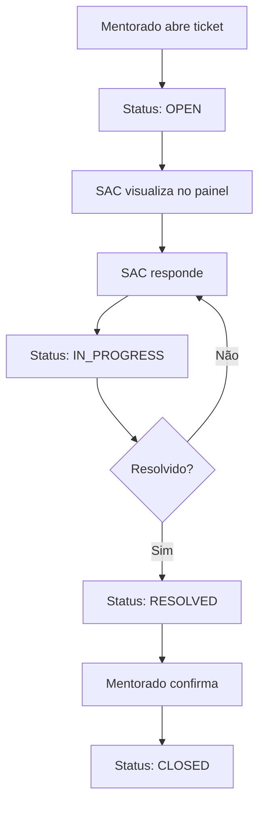

# Sistema SAC (Suporte ao Cliente) - Documentação Técnica

## Visão Geral

O Sistema SAC é uma extensão do sistema de tickets existente, criando um departamento dedicado de suporte ao cliente com painel próprio, permissões específicas e métricas de atendimento.

## Arquitetura

### Roles e Permissões

| Role | Acesso | Permissões |
|------|--------|------------|
| `MENTEE` | `/dashboard` | Abrir tickets, enviar mensagens |
| `MENTOR` | `/mentoria` | Ver tickets dos mentorados (opcional) |
| `SUPPORT` | `/support` | Ver todos os tickets, responder, mudar status |
| `ADMIN` | Todos | Gerenciar operadores SAC, ver métricas |

### Fluxo de Atendimento



### Estrutura de Dados

**Nenhuma alteração nos modelos existentes:**

```prisma
model SupportTicket {
  id        String          @id @default(cuid())
  userId    String
  subject   String?
  status    TicketStatus    @default(OPEN)  // ✅ Já existe
  createdAt DateTime        @default(now())
  updatedAt DateTime        @updatedAt
  user      User            @relation(...)
  messages  TicketMessage[]
}

enum TicketStatus {
  OPEN          // Ticket aberto, aguardando atendimento
  IN_PROGRESS   // SAC está trabalhando no ticket
  RESOLVED      // Problema resolvido, aguardando confirmação
  CLOSED        // Ticket finalizado
}
```

**Única alteração necessária:**

```prisma
enum Role {
  MENTOR
  MENTEE
  ADMIN
  SUPPORT  // 👈 Nova role
}
```

## API Endpoints

### Novos Endpoints

#### `GET /api/support/tickets`
**Autenticação**: `SUPPORT` ou `ADMIN`

**Query Parameters:**
- `status`: Filtrar por status (OPEN, IN_PROGRESS, etc.)
- `search`: Buscar por nome/email do usuário ou assunto
- `page`: Paginação
- `limit`: Itens por página

**Response:**
```json
{
  "success": true,
  "tickets": [
    {
      "id": "clx123",
      "subject": "Dúvida sobre módulo",
      "status": "OPEN",
      "createdAt": "2026-02-10T18:00:00Z",
      "updatedAt": "2026-02-10T18:30:00Z",
      "user": {
        "name": "João Silva",
        "email": "joao@email.com"
      },
      "_count": {
        "messages": 3
      },
      "unreadCount": 1,
      "lastMessage": {
        "content": "Aguardando resposta...",
        "createdAt": "2026-02-10T18:30:00Z"
      }
    }
  ],
  "pagination": {
    "total": 45,
    "page": 1,
    "limit": 20
  }
}
```

#### `PATCH /api/support/tickets/[id]`
**Autenticação**: `SUPPORT` ou `ADMIN`

**Body:**
```json
{
  "status": "IN_PROGRESS"  // ou RESOLVED, CLOSED
}
```

**Response:**
```json
{
  "success": true,
  "ticket": {
    "id": "clx123",
    "status": "IN_PROGRESS",
    "updatedAt": "2026-02-10T19:00:00Z"
  }
}
```

### Endpoints Modificados

#### `POST /api/tickets/[id]/messages`
**Alteração**: Permitir que `SUPPORT` envie mensagens

```typescript
// Antes: Apenas o dono do ticket ou ADMIN
if (dbUser.id !== ticket.userId && dbUser.role !== 'ADMIN') {
  return NextResponse.json({ error: 'Forbidden' }, { status: 403 });
}

// Depois: Incluir SUPPORT
if (dbUser.id !== ticket.userId && 
    dbUser.role !== 'ADMIN' && 
    dbUser.role !== 'SUPPORT') {
  return NextResponse.json({ error: 'Forbidden' }, { status: 403 });
}
```

## Interface do Usuário

### Painel SAC (`/support`)

**Componentes principais:**

1. **Header com Métricas**
   - Tickets abertos
   - Tickets em andamento
   - Tickets resolvidos hoje
   - Tempo médio de resposta

2. **Filtros e Busca**
   - Status (Todos, Abertos, Em andamento, Resolvidos)
   - Busca por nome/email/assunto
   - Ordenação (mais recentes, mais antigos, não lidos)

3. **Lista de Tickets**
   - Card com informações resumidas
   - Badge de status colorido
   - Indicador de mensagens não lidas
   - Timestamp relativo

### Visualização de Ticket (`/support/ticket/[id]`)

**Seções:**

1. **Cabeçalho**
   - Informações do mentorado
   - Dropdown de status
   - Botão voltar

2. **Thread de Mensagens**
   - Mensagens do mentorado (alinhadas à esquerda)
   - Mensagens do SAC (alinhadas à direita)
   - Timestamps relativos
   - Scroll automático

3. **Campo de Resposta**
   - Textarea com auto-resize
   - Botão "Enviar"
   - Botão "Resolver Ticket" (atalho para mudar status)

## Métricas e Analytics

### Dashboard Admin (`/admin/sac-metrics`)

**Métricas disponíveis:**

1. **Visão Geral**
   - Total de tickets (hoje, semana, mês)
   - Taxa de resolução
   - Tickets pendentes

2. **Performance**
   - Tempo médio de primeira resposta
   - Tempo médio de resolução
   - SLA compliance (futuro)

3. **Por Operador**
   - Tickets resolvidos por operador
   - Tempo médio de resposta
   - Avaliação (futuro)

4. **Gráficos**
   - Tickets por dia (linha)
   - Status distribution (pizza)
   - Horários de pico (barra)

## Segurança

### Validações de Permissão

**Middleware:**
```typescript
// Proteger rotas /support
if (pathname.startsWith('/support')) {
  if (role !== 'SUPPORT' && role !== 'ADMIN') {
    return NextResponse.redirect(new URL('/dashboard', request.url));
  }
}
```

**API Routes:**
```typescript
// Verificar role em cada endpoint
const allowedRoles = ['SUPPORT', 'ADMIN'];
if (!allowedRoles.includes(dbUser.role)) {
  return NextResponse.json({ error: 'Forbidden' }, { status: 403 });
}
```

### Auditoria

**Logs de ações:**
- Quem mudou o status do ticket
- Quando foi respondido
- Tempo de resolução

## Migration Guide

### 1. Atualizar Schema

```bash
# Editar prisma/schema.prisma
# Adicionar SUPPORT ao enum Role

# Criar migration
npx prisma migrate dev --name add_support_role

# Gerar cliente
npx prisma generate
```

### 2. Criar Primeiro Operador SAC

```bash
# Via API
curl -X POST https://seu-dominio.com/api/admin/users/create \
  -H "Content-Type: application/json" \
  -d '{
    "email": "sac@empresa.com",
    "password": "senha-segura",
    "name": "Operador SAC",
    "role": "SUPPORT"
  }'
```

### 3. Deploy

```bash
# Build local
npm run build

# Commit e push
git add .
git commit -m "feat: Add SAC support system"
git push

# Deploy automático no Vercel
```

## Testes

### Checklist de Testes

**Funcionalidade:**
- [ ] Criar usuário SUPPORT via admin
- [ ] Login com usuário SUPPORT
- [ ] Visualizar lista de tickets
- [ ] Filtrar tickets por status
- [ ] Buscar tickets
- [ ] Abrir ticket específico
- [ ] Enviar mensagem
- [ ] Mudar status do ticket
- [ ] Verificar notificação para mentorado

**Permissões:**
- [ ] SUPPORT não acessa `/admin`
- [ ] SUPPORT não acessa `/mentoria`
- [ ] MENTEE não acessa `/support`
- [ ] ADMIN acessa `/support`

**Performance:**
- [ ] Lista de tickets carrega em < 1s
- [ ] Mensagens carregam em < 500ms
- [ ] Busca responde em < 300ms

## Troubleshooting

### Erro: "Role SUPPORT not found"
**Causa**: Migration não foi aplicada

**Solução**:
```bash
npx prisma migrate deploy
npx prisma generate
```

### Erro: "Forbidden" ao acessar /support
**Causa**: Usuário não tem role SUPPORT

**Solução**:
1. Verificar role no banco de dados
2. Atualizar via admin ou SQL direto

### Tickets não aparecem no painel SAC
**Causa**: Query está filtrando incorretamente

**Solução**:
1. Verificar logs da API
2. Testar query no Prisma Studio
3. Verificar permissões do usuário

## Roadmap

### MVP (Sprint 1-3)
- ✅ Plano de implementação
- [ ] Migration e backend
- [ ] Interface básica
- [ ] Testes

### V1.1 (Futuro)
- [ ] Respostas prontas (templates)
- [ ] Atribuição automática
- [ ] SLA e alertas

### V2.0 (Futuro)
- [ ] Chatbot para FAQ
- [ ] IA para sugestão de respostas
- [ ] Pesquisa de satisfação (CSAT)

---

**Última atualização**: 10/02/2026
